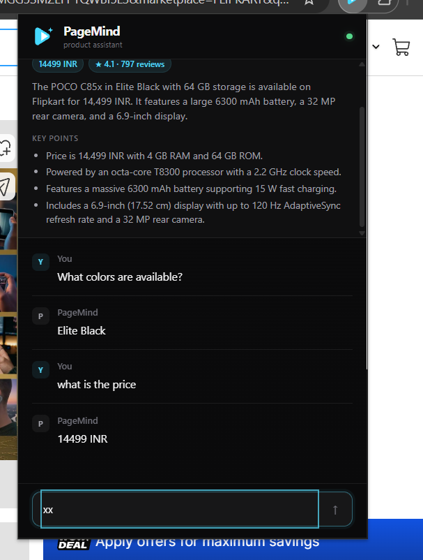
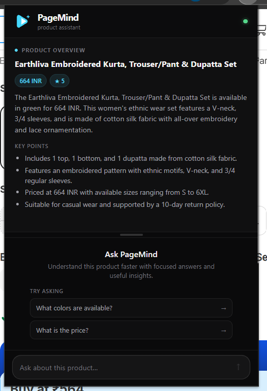
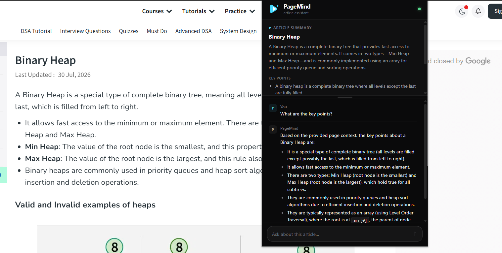

# 🧠 PageMind

> **An AI-powered browser assistant that understands the page you're currently viewing.**

PageMind is a Chrome extension that lets you **summarize, ask questions, and interact with YouTube videos, articles, and product pages directly from your browser**.

Instead of copying content into an AI chatbot, PageMind automatically detects the type of page you're viewing, extracts the relevant information, and provides grounded AI-powered answers inside a single extension popup.

<p align="center">

**🎥 YouTube · 📄 Articles · 🛍️ Products · 🤖 AI · 🔎 RAG**

</p>

---

## ✨ Features

### 🎥 YouTube Mode

* Extracts YouTube video transcripts
* Supports available Hindi and English transcripts
* Automatically falls back to the first available transcript
* Generates concise video summaries
* Ask questions about the video
* Retrieval-based answers grounded in transcript content
* Clickable timestamp citations that take you directly to the relevant moment
* Conversation history for follow-up questions

### 📄 Article Mode

* Automatically detects article pages
* Uses Mozilla Readability to extract the actual article content
* Removes navigation, advertisements, embedded code, and irrelevant page elements
* Generates concise summaries
* Extracts key points
* Ask questions using only the page content
* Avoids introducing unrelated outside information

### 🛍️ Product Mode

* Automatically detects product pages
* Extracts structured product information
* Supports information such as:

  * Product name
  * Price
  * Currency
  * Rating
  * Review count
  * Available sizes
  * Product description
* Ask questions about the product directly from the extension

### 🧠 Automatic Page Detection

PageMind automatically determines whether the active page is:

```text
YouTube Video
     │
     ├──→ Video Mode
     │
Article ──→ Article Mode
     │
Product ──→ Product Mode
     │
Generic ──→ Generic Page Mode
```

No manual mode switching is required.

---

## 🚀 Why PageMind?

Traditional AI workflows often look like:

```text
Find content
    ↓
Copy content
    ↓
Open AI chatbot
    ↓
Paste content
    ↓
Ask question
```

PageMind simplifies this:

```text
Open a page
    ↓
Click PageMind
    ↓
Page automatically detected
    ↓
AI summary + Q&A
```

The goal is to make **research, learning, shopping, and content consumption faster without leaving the current webpage**.

---

## 🏗️ Architecture

```text
                    ┌──────────────────────┐
                    │      Chrome          │
                    │      Extension       │
                    └──────────┬───────────┘
                               │
                               ▼
                    ┌──────────────────────┐
                    │   Page Detection &   │
                    │   Content Extraction │
                    └──────────┬───────────┘
                               │
                ┌──────────────┼──────────────┐
                │              │              │
                ▼              ▼              ▼
             YouTube        Article        Product
                │              │              │
                └──────────────┼──────────────┘
                               │
                               ▼
                    ┌──────────────────────┐
                    │      FastAPI         │
                    │       Backend        │
                    └──────────┬───────────┘
                               │
                    ┌──────────┴───────────┐
                    │                      │
                    ▼                      ▼
              Gemini LLM            Gemini Embeddings
                                           │
                                           ▼
                                      FAISS Retrieval
                                           │
                                           ▼
                                      Grounded Answer
```

---

## 🔄 How It Works

### 1. Page Detection

When the extension popup opens, PageMind communicates with the active tab and determines what type of content is currently being viewed.

### 2. Content Extraction

Depending on the page type:

**YouTube**

```text
Video URL
   ↓
Transcript extraction
   ↓
Transcript chunks
```

**Article**

```text
Web page
   ↓
Mozilla Readability
   ↓
Clean article content
```

**Product**

```text
Product page
   ↓
JSON-LD / page markup
   ↓
Structured product information
```

### 3. Backend Processing

The extracted content is sent to the FastAPI backend.

The backend:

* Creates documents
* Splits content into chunks
* Generates embeddings
* Stores/retrieves vectors using FAISS
* Builds context for the LLM
* Generates grounded responses

### 4. Question Answering

For YouTube videos, retrieved transcript chunks include source identifiers and timestamps.

The AI generates citations such as:

```text
[C1]
[C2]
```

which the backend converts into clickable timestamps.

---

## 🧰 Tech Stack

| Layer               | Technology                   |
| ------------------- | ---------------------------- |
| Extension           | React + Vite                 |
| Extension Platform  | Chrome Extension Manifest V3 |
| Backend             | Python + FastAPI             |
| LLM                 | Google Gemini                |
| Embeddings          | Gemini Embeddings            |
| Vector Store        | FAISS                        |
| AI Framework        | LangChain                    |
| YouTube Transcripts | youtube-transcript-api       |
| Article Extraction  | Mozilla Readability          |
| Product Extraction  | JSON-LD + Page Markup        |
| Frontend Styling    | CSS                          |
| Deployment          | Vercel / Render              |

---

## 📁 Project Structure

```text
PageMind/
│
├── backend/
│   ├── main.py
│   ├── requirements.txt
│   └── .env
│
├── extension/
│   ├── src/
│   │   ├── App.jsx
│   │   ├── contentScript.js
│   │   └── components/
│   │       ├── Header.jsx
│   │       ├── VideoPanel.jsx
│   │       ├── ArticleView.jsx
│   │       ├── ProductView.jsx
│   │       ├── ChatWindow.jsx
│   │       ├── MessageRow.jsx
│   │       └── ChatInput.jsx
│   │
│   └── public/
│       ├── manifest.json
│       └── background.js
│
├── .gitignore
└── README.md
```

---

# ⚡ Quick Start

There are two ways to use PageMind.

## Option 1 — Download the Extension

> **Coming with the first GitHub Release**

1. Download the latest `PageMind.zip` from the **Releases** section.
2. Extract the ZIP.
3. Open Chrome.
4. Navigate to:

```text
chrome://extensions
```

5. Enable **Developer mode**.
6. Click **Load unpacked**.
7. Select the extracted extension folder.
8. Pin PageMind to your Chrome toolbar.
9. Open a YouTube video, article, or product page.
10. Click the PageMind icon.

---

# 🛠️ Local Development

## Backend

Clone the repository:

```bash
git clone https://github.com/Kaifu-stack/PageMind.git

cd PageMind/backend
```

Create a virtual environment:

### Windows

```bash
python -m venv venv
venv\Scripts\activate
```

### macOS / Linux

```bash
python -m venv venv
source venv/bin/activate
```

Install dependencies:

```bash
pip install -r requirements.txt
```

Create:

```text
backend/.env
```

Add your Gemini API key:

```env
GOOGLE_API_KEY=your_gemini_api_key
```

Start the backend:

```bash
uvicorn main:app --reload --port 8000
```

The API will be available at:

```text
http://127.0.0.1:8000
```

---

## Extension

Open a second terminal:

```bash
cd PageMind/extension
```

Install dependencies:

```bash
npm install
```

Build the extension:

```bash
npm run build
```

Then:

1. Open `chrome://extensions`
2. Enable **Developer mode**
3. Click **Load unpacked**
4. Select:

```text
PageMind/extension/dist
```

5. Open a supported webpage.
6. Click the PageMind extension.

---

# 🌐 Production Backend

PageMind uses a FastAPI backend for AI processing.

The extension communicates with the backend rather than exposing AI credentials directly inside the browser extension.

```text
Chrome Extension
       │
       ▼
Production API
       │
       ▼
FastAPI
       │
       ├── Gemini
       ├── Gemini Embeddings
       └── FAISS
```

# ⚠️ Current Limitations

### YouTube Transcript Availability

YouTube transcript availability depends on the individual video.

Some videos may not have accessible transcripts, may have transcripts disabled, or may temporarily trigger YouTube IP restrictions.

If YouTube temporarily blocks transcript requests, the backend may return a `429` response.

The application can be retried later.

> YouTube mode may therefore be less reliable than article and product modes depending on YouTube's automated traffic restrictions.

### Chrome Extension Development Mode

The current downloadable version is intended to be installed using Chrome's **Developer mode**.

A Chrome Web Store release is planned for a future version.

---

## 📸 Screenshots

<p align="center">
  
  
</p>

<p align="center">
  
</p>

# 🗺️ Roadmap

* [x] YouTube transcript extraction
* [x] YouTube RAG Q&A
* [x] Timestamp-based citations
* [x] YouTube summaries
* [x] Article extraction
* [x] Article Q&A
* [x] Product page detection
* [x] Structured product information
* [x] Product Q&A
* [x] Automatic page-type detection
* [x] Gemini-powered responses
* [x] FAISS retrieval
* [x] Production backend deployment
* [ ] Public downloadable release
* [ ] Per-user rate limiting
* [ ] Chrome Web Store publication
* [ ] Multi-tab comparison
* [ ] Improved YouTube reliability
* [ ] Additional page types

---

# 🔒 Privacy

PageMind is designed to process only the content required for the current analysis.

For article and product pages, content is extracted from the active webpage and sent to the backend for AI processing.

For YouTube pages, transcript content is retrieved for analysis.

> Before using PageMind with sensitive information, review the project's backend configuration and deployment environment.

---

# 👨‍💻 Author

**Md Kaif Alam**

B.Tech Computer Science student focused on:

* React
* Backend Development
* Data Structures & Algorithms
* AI / GenAI
* RAG Applications

---

# ⭐ Support

If you find PageMind interesting, consider giving the repository a ⭐ on GitHub.

It helps the project gain visibility and motivates further development.

---

## 📄 License

Copyright © 2026 Kaif Alam.

PageMind is a personal portfolio project developed to demonstrate the application of modern web development, RAG, and Generative AI technologies.

The source code is publicly available for viewing, learning, and evaluation. All rights reserved.
